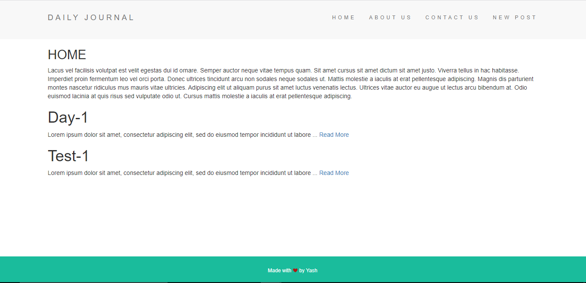

# Personal-Blog-Diary-Website - This is one of the Boss Challenge in The Complete Web Development Bootcamp Course by Angela Yu.

The Web app focusses on implementing Full Stack Web Development Using NodeJS and ExpressJS as backend along with use of EJS for templating and layouts functionality for better code structuring. Also used Lodash for working with url and strings.

This project is a template for a simple personal diary/blog website. The project currently is a V1 with no database and thus, support for data storage will be added in V2.

## Snapshots:
### (1) Home Page -

###  (2) About Page -

###  (3) Contact Page -

###  (4) Compose Page -

###  (5) Post Page -

### Links

- Solution URL:  [Solution  URL](https://github.com/yashgjoshi20/Personal-Blog-Diary.git)
- Live Site URL: [GitHub Pages Live URL](https://yashgjoshi20.github.io/Personal-Blog-Diary/)

## Inspiration:
The inspiration for the website have been taken from the follwing:
* [Angela Yu](https://github.com/angelabauer)'s Complete Web Development Bootcamp Course on Udemy.

## Acknowledgements:
I'd like to express my greatest gratitude towards Angela Yu for her amazing teaching efforts and course.
For the website I've used the following resources:
* ***Icons***: [FlatIcons](https://www.flaticon.com/)
* ***Fonts***: [GoogleFonts](https://fonts.google.com/)
* ***Bootstrap***: [Bootstrap](https://getbootstrap.com/)
* ***External Packagers***: [NPM](https://www.npmjs.com/)

 ## Author

- GitHub - Yash Joshi (https://github.com/yashgjoshi20)
